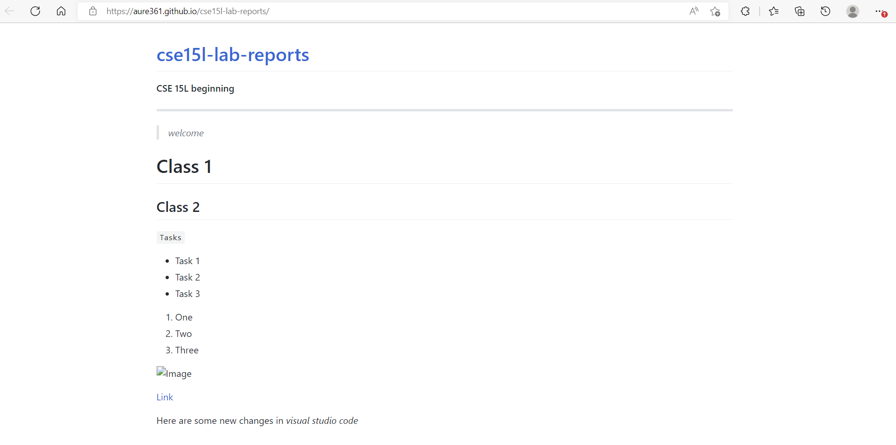

## How to log into a course-specific account on ieng6 *(Windows)*

> Step 1: Installing VScode

Download link and instructions: https://code.visualstudio.com/

- once downloaded it should look like this

**Info**

- I had visual studio code already downloaded but the link provided should help you get set up with VScode. Follow the instructions in the link and it should look like the image above when opened.

> Step 2: Remotely Connecting

- [Download OpenSSH client only](https://docs.microsoft.com/en-us/windows-server/administration/openssh/openssh_install_firstuse)

**Info**

- I had OpenSSH client downloaded already. You are able to check by going to Settings>Apps>Optional Features

- As shown in the image above, open the terminal in VScode and type the following command: ssh cs15lfa22hi@ieng6.ucsd.edu *(type username correspondingly)*

- When you login in for the first time you will be prompted a yes/no question, answer yes and type in your password

> Step 3: Trying Some Commands

**Info** 

- Once logged into the remote server, run commands.

- The image above shows an example of running the command *cat /home/linux/ieng6/cs15lfa22/public/hello.txt* which opens the file hello.txt and displays the message “Hi! Welcome to CSE15L Fall 22”

- You can log out of the remote server by writing the command *exit* in the terminal

> Step 4: Moving Files with scp

**Info** 
- The image above shows the result of moving files from your computer to the remote server

- In this scenario, a java file "WhereAmI.java" was created and compiled in the local computer and then moved to the remote server by executing following command: scp WhereAmI.java cs15lfa22hi@ieng6.ucsd.edu:~/ *(type username correspondingly)*

> Step 5: Setting an SSH Key

**Info** 
- I'm a window's user so I followed the following instructions: https://docs.microsoft.com/en-us/windows-server/administration/openssh/openssh_keymanagement#user-key-generation in order to use ssh and scp without a password

- On client terminal run: ssh-keygen -t ed25519

- I was then prompted to enter a paraphrase which I chose as the key "enter"

- Then on remote server I executed the following command: mkdir .ssh 

- Then, back on client I executed the following command: scp C:\Users\Aurelio/.ssh/id_ed25519.pub cs15lfa22hi@ieng6.ucsd.edu:~/.ssh/authorized_keys *(type username correspondingly)*

- The image above demonstrates the use of ssh without the use of typing a password

> Step 6: Optimizing Remote Running

**Info** 
- The image above demonstrates optimizing remote running. For instance, once a file is edited (in this case WhereAmI.java) run the command: scp WhereAmI.java cs15lfa22hi@ieng6.ucsd.edu:~/ 

- Then run the command: ssh cs15lfa22hi@ieng6.ucsd.edu "javac WhereAmI.java; java WhereAmI" *(within quotes you are able to directly run commands on the remote server, additionally you are able to run multiple commands by placing semicolons between them)*