## Part One

**Code**

`import java.io.IOException;`

`import java.net.URI;`

`import java.util.ArrayList;`

`class Handler implements URLHandler {`

    ArrayList<String> stringList = new ArrayList<>();
    public String handleRequest(URI url) {
        if (url.getPath().equals("/")) {
            return String.format("Stringlist: ");
        } else if (url.getPath().equals("/Stringlist")) {
            return String.format("Stringlist is now: " + stringList);
        } else {
            System.out.println("Path: " + url.getPath());
            if (url.getPath().contains("/add")) {
                String[] parameters = url.getQuery().split("=");
                if (parameters[0].equals("s")) {
                    stringList.add(parameters[1]);
                    return String.format("Has been added to StringList: " + parameters[1]);
                }
            }
            return "404 Not Found!";
        }
    }
`}`

`class NumberServer {`

    public static void main(String[] args) throws IOException {
        if(args.length == 0){
            System.out.println("Missing port number! Try any number between 1024 to 49151");
            return;
        }

        int port = Integer.parseInt(args[0]);

        Server.start(port, new Handler());
    }
`}`

> Loading server

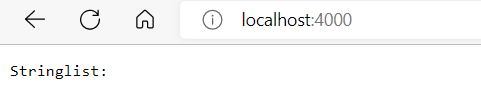

- The method handleRequest(URI url) is called. The relevant arguments are either nothing after the 4000 or "/". If these values are found in the url, then once the request is processed it will show a server that displays "Stringlist:"

> Adding strings to server

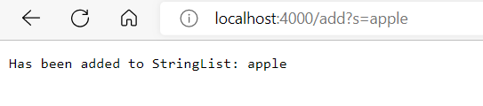

- The method handleRequest(URI url) is called. The relevant arguments are "/add". If these values are found in the url, the string found after the query will be added to a string list. Then the server will display "Has been added to Stringlist: *string added*"

> Displaying updated Stringlist

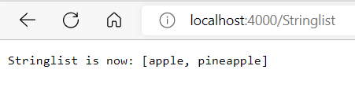

- The method handleRequest(URI url) is called. The relevant arguments are "/Stringlist". If these values are found in the url, then it will return a string format of the stringlist. The server will display "Stringlist is now: *list of strings*"

## Part Two
 > Bug 1

 **ArrayExamples - reverseInPlace**

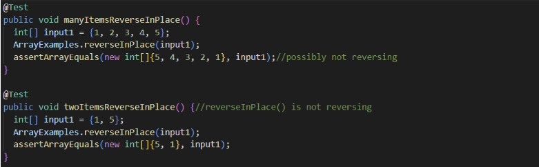
 - The failure-inducing input was {1, 2, 3, 4, 5}

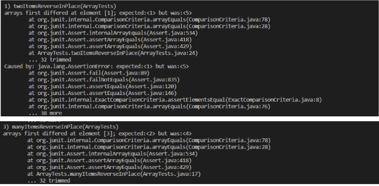
 - The sympton was at index 3 it expected a value 2 and not a 4

 - The bug was it's not reversing the list. So in order to fix it, I did the following. 
 
 *Original vs New*

 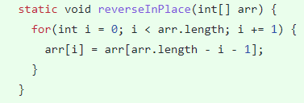

 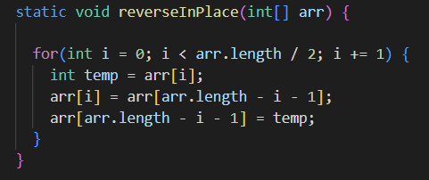

 - One can see that the original code wasn't switching the first elements to the end, instead the for loop was moving the last elements to the front. In the fixed code, a temp value was created to save the element being reversed. Also it took into consideration arrays that were odd or even in index by diving the length of the for loop by 2.
 
 - Ultimately the bug caused that particular symptom because it was not saving the value of the element that was going to be reversed.

 > Bug 2

**ListExamples - filter**

 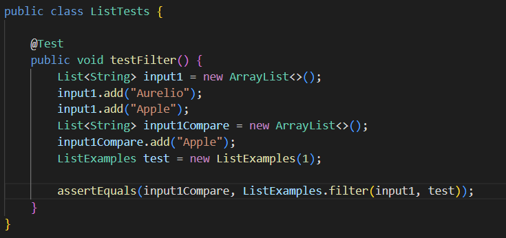

- The failure-inducing input was the above

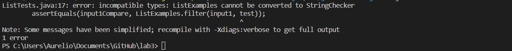

 - The Sympton were compile errors because the checkString method had not been implemented in ListExamples.

 *Original vs New*

 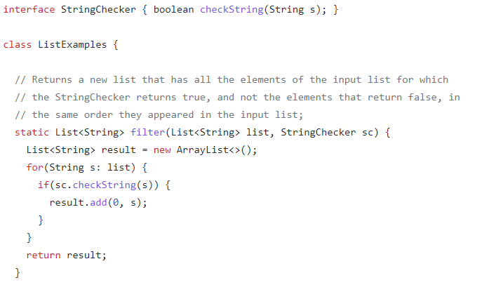

 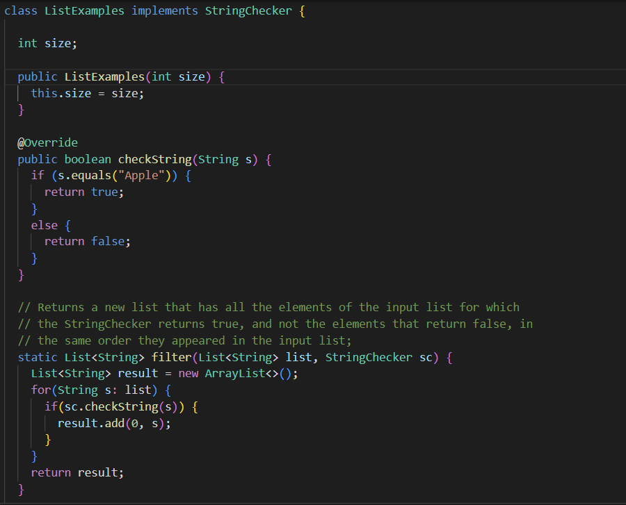 

 - The bug was fixed by first of all making sure that ListExamples implemented the interface StringChecker and adding the implementation of the method checkString(String s). Then creating a constructor that would allow creating an object of ListExamples to be able to test the method filter()

 - Ultimately the bug caused that particular symptom because it needed some implementations to allow the tests to run.
