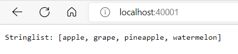
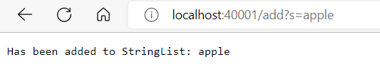
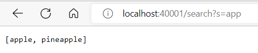

## Part One

**Code**

`import java.io.IOException;`

`import java.net.URI;`

`import java.util.ArrayList;`

`class Handler implements URLHandler {`

`ArrayList<String> stringList = new ArrayList<>();`

    public String handleRequest(URI url) {
        if (url.getPath().equals("/")) {
            return String.format("Stringlist: " + stringList);
        } 
        System.out.println("Path: " + url.getPath());
        if (url.getPath().contains("/search")) {
            String[] parameters = url.getQuery().split("=");
            if (parameters[0].equals("s")) {
                ArrayList<String> subStringList = new ArrayList<>();
                for (int i = 0; i < stringList.size(); i += 1) {
                    if (stringList.get(i).contains(parameters[1])) {
                        subStringList.add(stringList.get(i));
                    }
                }
                return String.format("" + subStringList);
            }            
            return "404 Not Found!";
        }
        else {
            System.out.println("Path: " + url.getPath());
            if (url.getPath().contains("/add")) {
                String[] parameters = url.getQuery().split("=");
                if (parameters[0].equals("s")) {
                    stringList.add(parameters[1]);
                    return String.format("Has been added to StringList: " + parameters[1]);
                }
            }
            return "404 Not Found!";
        }
    }
}

`class NumberServer {`

    public static void main(String[] args) throws IOException {
        if(args.length == 0){
            System.out.println("Missing port number! Try any number between 1024 to 49151");
            return;
        }

        int port = Integer.parseInt(args[0]);

        Server.start(port, new Handler());
    }
`}`

> Tracks a list of strings

- The method handleRequest(), getPath(), equals() and format() are called. 

- In this scenario, getPath() and equals() method check if the url has the argument "/". In addition, stringList is a relevant value to format(), as it will convert the string Arraylist into a string form to display in the web page. 

- If the value "/" was changed to an argument where after the "/" it wasn't supported by the code, then it will display the following message, "404 Not Found!". **Query support shown in the following pages**

>  A path for adding a new string to the list

- The method handleRequest(), getPath(), contains(), getQuery(), split(), equals(), add(), and format() are called.

- In this scenario, getPath() and contains() method check if the url has the argument "/add". If true, getQuery() and split() will create two arguments off the url. Then equals() will check if the first argument is an "s" and if so will call add() on the second argument. A relevant field is the ArrayList<String> stringList; because the add() method will add strings to this arraylist. Strings which the query determines as the second argument or parameters[1].

- If the value parameters[1] was to change, then it will add a different string to the arraylist of strings. In the browser it would display the message "Has been added to StringList: " and the string that was added.

> Querying the list of strings and returning a list of all strings that have a given substring

- The method handleRequest(), getPath(), contains(), getQuery(), split(), equals(), size() get(), add(), and format() are called.

- In this scenario, getPath() and contains() method check if the url has the argument "/search". If true, getQuery() and split() will create two arguments off the url. Then equals() will check if the first argument is an "s" and if so will use the second argument, parameters[1]. A relevant field is ArrayList<String> subStringList; because it will keep track of strings that contain the substring that is given by parameters[1]. 

- If parameters[1] is changed, then the web page will display a new string list according to the given parameters[1]. Note: parameters[1] is an input in the url after "=" that is used to check if an element on Array<String> stringList; contains that substring. If so it will add this element to Array<String> subStringList;

## Part Two
 > Bug 1

 **ArrayExamples - reverseInPlace**

 - The failure-inducing input was {1, 2, 3, 4, 5}

 - The sympton was at index 3 it expected a value 2 and not a 4

 - The bug was it's not reversing the list. So in order to fix it, I did the following. 
 
 *Original vs New*

 

 

 - One can see that the original code wasn't switching the first elements to the end, instead the for loop was moving the last elements to the front. In the fixed code, a temp value was created to save the element being reversed. Also it took into consideration arrays that were odd or even in index by diving the length of the for loop by 2.
 
 - Ultimately the bug caused that particular symptom because it was not saving the value of the element that was going to be reversed.

 > Bug 2

**ListExamples - filter**

 

- The failure-inducing input was the above

 - The Sympton were compile errors because the checkString method had not been implemented in ListExamples.

 *Original vs New*

 

  

 - The bug was fixed by first of all making sure that ListExamples implemented the interface StringChecker and adding the implementation of the method checkString(String s). Then creating a constructor that would allow creating an object of ListExamples to be able to test the method filter()

 - Ultimately the bug caused that particular symptom because it needed some implementations to allow the tests to run.
