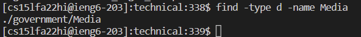
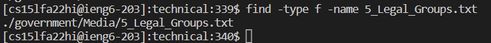
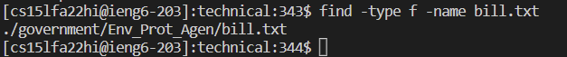
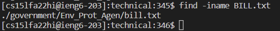
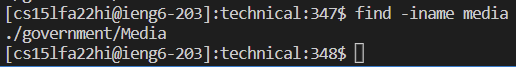
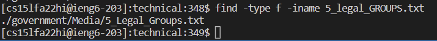
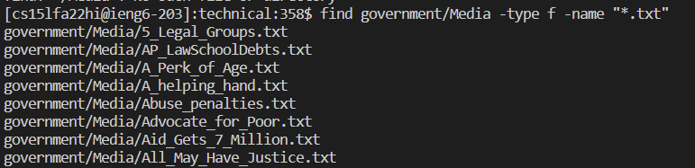
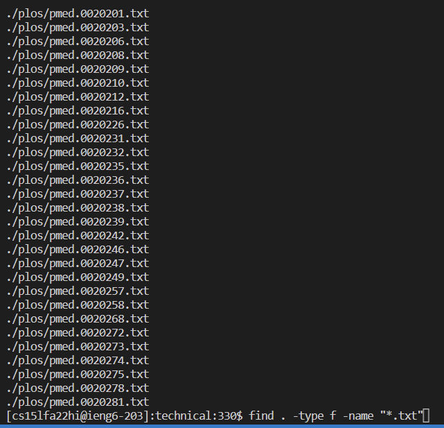
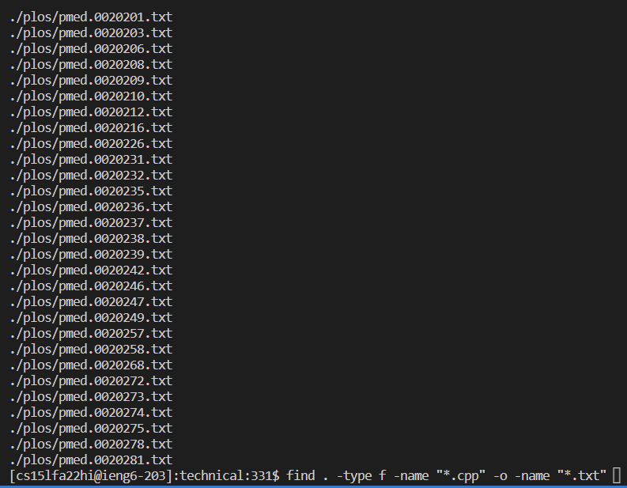

## Alternative ways to use find

> Find only files or only directories

*Example 1:*

- This command is specifying that we are searching for a directory named Media. This is useful when we have a file and directory with the same name.

*Example 2:*

- This command is specifying that we are searching for a file named 5_Legal_Groups.txt. This is useful because it specify if we are searching for a file or directory.

*Example 3:*

- This command is specifying that we are searching for a file named bill.txt. This is useful because not only does it specify the type we searching for, but also it displays the path of the file.

> Run a case-insensitive search

*Example 1:*

- The command allows you to find files while being case-insensitive. This is useful because not capitalizing a letter of the name of the file you are searching will not result on an invalid output.

*Example 2:*

- The command finds a directory media and returns the directory Media. This is useful in a scenario where you may have a typo in your capitilizations.

*Example 3:*

- The command finds a file that clearly has the wrong capitilizations of the original file in /technical. This is useful because you will be given a correc output even if you miss a capitilization. 

> Search files by their extension

*Example 1:*

- The command specifies the directory we will be searching in for files with the extension .txt. This is useful when we want to find specific type of files in a specific directory.

*Example 2:*

- This command finds every possible file that has the extension .txt. This can be useful to see how many files we have of a certain extension.

*Example 3:*

- This command finds every possible file that has the extension .cpp or .txt. This can be useful to find files with different extensions all in one instance.

