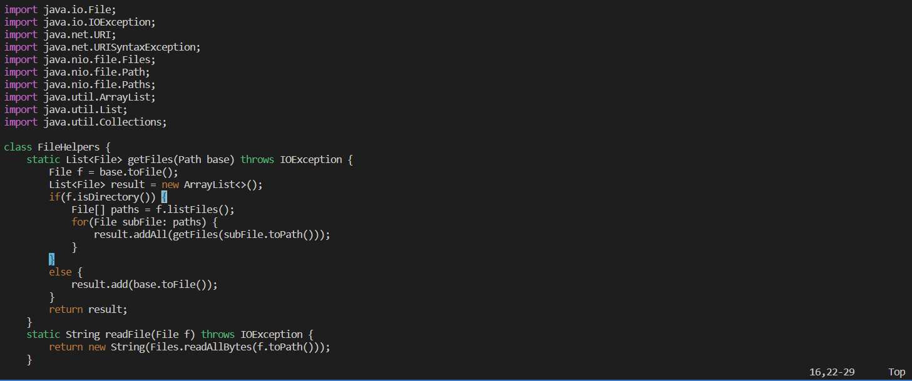
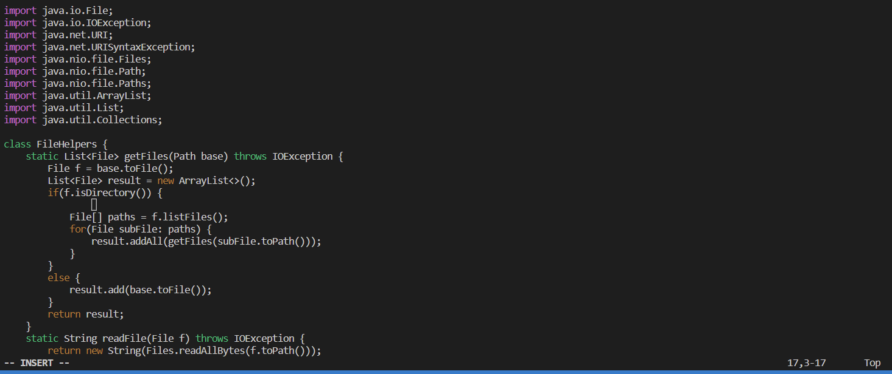
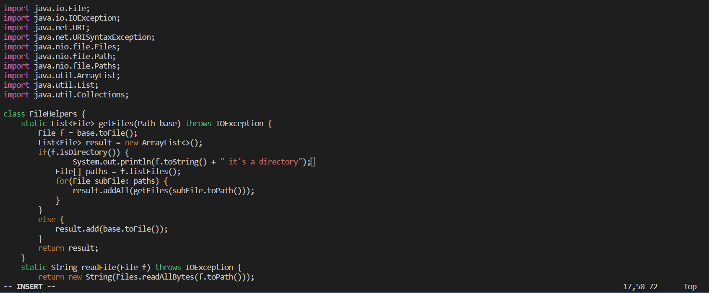
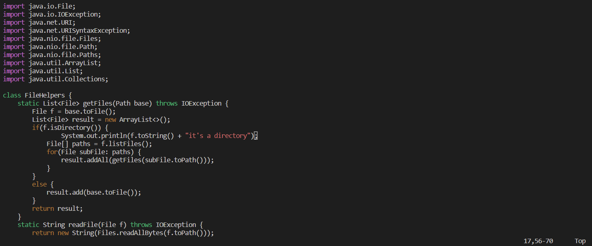

# Part One

## Adding a new line to print before File[] paths = f.listfiles()

> Step 1

j j j j j j j j j j j j j j j j j j j j (16 j's)

l l l l l l l l l l l l l l l l l l l l l l l l l l l l l l (30 L's)

> Step 2

- Press `O` to enter insert mode and create a line before "File[] paths = f.listFiles();" (note: in vim, when you are in visual mode and press O. You will enter insert mode and automatically add a line)

> Step 3

- Type `System.out.println(f.toString() + "it's a directory");`

> Step 4

- Press `<esc>`

> Step 5

- Type `:wq <enter>`

# Part Two

> Report how long it took you to make the edit in seconds in both styles, and any difficulties or details that came up in doing so.

It took me 50 seconds for to perform the first style, and 43 seconds to perform the second style. A diffulty on the first style was copying the edited file into the remote server with scp. This can become problematic if it's a very large file, especially if you just makes a few changes. The reason being, you will have to copy the entire file into the remote server.

> Which of these two styles would you prefer using if you had to work on a program that you were running remotely, and why?

I would prefer to use the second style, because the program will already be running remotely. So, it would be inconvinent to work on it locally and copy your changes to the remote server consitently. 

> What about the project or task might factor into your decision one way or another? (If nothing would affect your decision, say so and why!)

As mentioned above, I believe if we are working on a big project, then it will certaintly contain files that are very large. Therefore, scp may take more time than necessary to get your edits to the remote server. There are ways to reduce this time by specifying the file you want to copy into the remote sevrer. Although, I find it more convient to work directly through the remote server in this scenario.