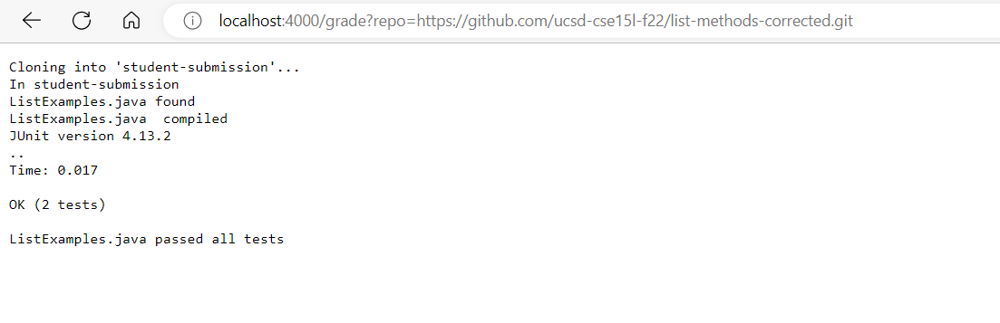
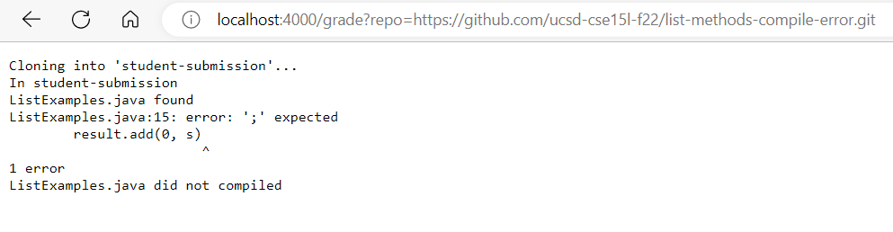
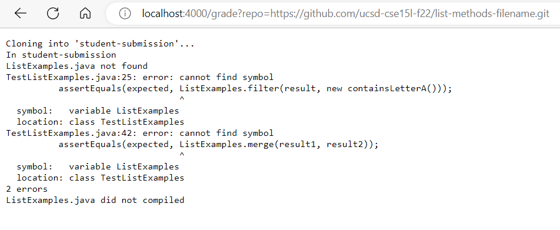

`rm -rf student-submission`

`git clone $1 student-submission`

`echo "In student-submission"`

`if [[ -e student-submission/ListExamples.java ]]`

`then`
	
    echo "ListExamples.java found"
`else`

	echo "ListExamples.java not found"
`fi`

`cp TestListExamples.java student-submission/`

`cd student-submission/`

`javac -cp ".;../lib/hamcrest-core-1.3.jar;../lib/junit-4.13.2.jar" *.java`

`if [[ $? -eq 0 ]]`

`then`

	echo "ListExamples.java  compiled"

`java -cp ".;../lib/junit-4.13.2.jar;../lib/hamcrest-core-1.3.jar" org.junit.runner.JUnitCore TestListExamples`

`if [[ $? -eq 0 ]] `

`then `

	echo "ListExamples.java passed all tests"

`else `

	echo "java -cp .;../lib/junit-4.13.2.jar;../lib/hamcrest-core-1.3.jar org.junit.runner.JUnitCore TestListExamples > output.txt"
	exit 1
`fi`

`else `

	echo "ListExamples.java did not compiled"
	exit 1
`fi`

> Example 1: https://github.com/ucsd-cse15l-f22/list-methods-corrected

> Example 2: https://github.com/ucsd-cse15l-f22/list-methods-compile-error

> Example 3: https://github.com/ucsd-cse15l-f22/list-methods-filename

> Trace of Example 2

After adding standard output and standard error to the grade script, the following were all the standard output and standard error for Example 2

- git clone $1 student-submission > out5.txt 2> err5.txt

standard output: empty

standard error: Cloning into 'student-submission'...

- echo "ListExamples.java found" > out6.txt 2> err6.txt

standard output: ListExamples.java found

standard error: emtpy

With this information we can see the indicated student-submission is cloned and the ListExamples.java is found. Furthermore, the rest of the commands were empty, but we can still analyze some of them such as rm -rf student-submission. This command cleans out the student-submission directory to ensure no previous information stays when its runned again. Going more in depth, we know for this specific example, the code doesn't compile due to a syntax error. So, when "javac -cp ".;../lib/hamcrest-core-1.3.jar;../lib/junit-4.13.2.jar" *.java" is ran, the following if statement is dealing with a return code that is nonzero. Hence it's not able to perform any of the following if statements, because a nonzero does not equal 0, hence its false (`[[ $? -eq 0 ]]`, $? == return code of non zero; hence non zero does not equal 0, so its false). Therefore it goes on to perform the else statement. As seen below... 

`else `

	echo "ListExamples.java did not compiled"
	exit 1

`fi`

this demonstrates that Example 2 does not compile and lets the user know by echoing the output "ListExamples.java did not compiled" and proceeds to exit. We know that because it exits here, this is the end of the grade script. Hence all lines were executed, except the code within the if branches that we have explained why in the text above.